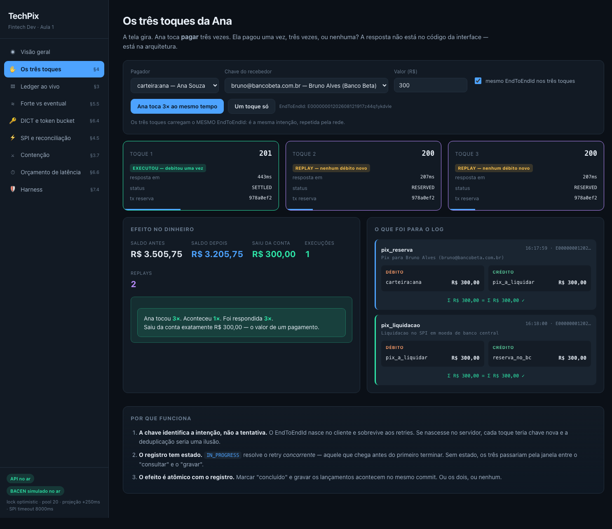
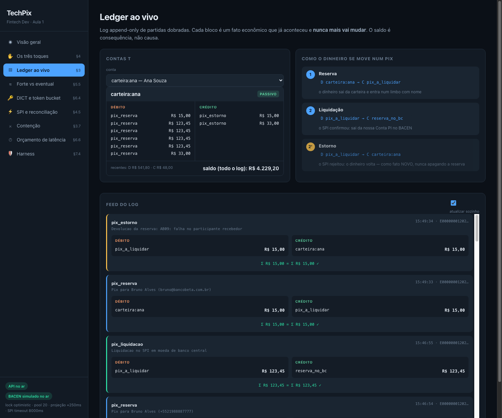

# TechPix — código da Aula 1 · Fintech Dev

> "A Ana pagou uma vez, três vezes, ou nenhuma?"

Um **monólito modular** em **Go + Docker** que implementa, de forma executável, as
decisões da Aula 1: ledger de partida dobrada append-only, idempotência por
EndToEndId, integração com DICT e SPI (simulados com as regras reais), consistência
forte no núcleo e eventual na borda, e orçamento de latência medido passo a passo.

Tudo que a aula afirma, aqui roda — e falha quando deve falhar.

---

## Subir em 2 minutos

```bash
make up          # postgres + bacen-sim + techpix
make painel      # abre http://localhost:8080
```

Requisitos: Docker e `make`. Go só é necessário para rodar fora do container.

---

## O painel da aula

Tudo que a aula precisa mostrar acontece em **http://localhost:8080** — servido pelo próprio
monólito, sem npm, sem bundler, sem CDN. HTML, CSS e JS embutidos no binário Go.



| Tela | Seção | O que a turma vê |
|---|---|---|
| **Visão geral** | §2, §3 | Ativo = Passivo em tempo real, invariantes, plano de contas, cash-in |
| **Os três toques** | §1, §4 | Três requisições simultâneas → **1 débito, 3 respostas**, com o mesmo `tx_reserva` |
| **Ledger ao vivo** | §3 | Feed de partidas dobradas com `Σ D = Σ C ✓`, contas T, o fluxo do dinheiro |
| **Forte vs eventual** | §5.5 | Gráfico ao vivo das duas leituras divergindo e convergindo |
| **DICT e token bucket** | §6.4 | Balde esvaziando: 404 custa 20 tokens; breaker abrindo; cache poupando |
| **SPI e reconciliação** | §4.1, §4.5 | Buraco negro, linha do tempo do pagamento e a **janela de incerteza** medida |
| **Contenção** | §3.7 | N pagamentos simultâneos, grade de aprovados/recusados, retries de serialização |
| **Orçamento de latência** | §6.6 | Barra do teto de 40s por passo, p50/p99/p99.9 contra os números oficiais |
| **Harness** | §7.4 | 5 invariantes ao vivo + **botões para tentar furar cada guardrail** |

Cada tela tem os controles do experimento (valor, conta, chave, nº de disparos) e um bloco
explicando o *porquê* — dá para conduzir a aula inteira sem abrir um terminal.



O painel é só mais um cliente da API pública: não tem atalho nenhum para dentro do sistema.

---

## As mesmas demos, por terminal

Se preferir (ou se o projetor recusar o navegador):

| Comando | Seção | O que acontece |
|---|---|---|
| `make demo-ana` | §1, §4 | Ana toca "pagar" 3× ao mesmo tempo → 1 débito, 3 respostas |
| `make demo-dict` | §6.4 | Token bucket: 404 custa 20 tokens, depois 429, depois o breaker abre |
| `make demo-eventual` | §5.5 | Saldo forte e eventual divergindo por ~350ms — e convergindo |
| `make demo-reconcile` | §4.1, §4.5 | O SPI liquida e **engole a resposta**; a reconciliação resolve |
| `make demo-contencao` | §3.7 | 12 pagamentos simultâneos: só cabem 6, e só 6 passam |
| `make test` | §7.4 | As invariantes como **fitness functions** (16 testes) |
| `make fitness` | §7.4 | As mesmas invariantes verificadas **ao vivo**, contra o banco em uso |

---

## O que está implementado, seção por seção

### §3 — O ledger como decisão de System Design

- **Partida dobrada.** Toda transação é um conjunto balanceado de lançamentos.
  Verificado em três camadas: no código, na constraint trigger `DEFERRED` do
  Postgres, e na fitness function.
- **Log é verdade, saldo é projeção.** Não existe coluna de saldo no write model.
  `account_balance()` é uma `SUM` sobre `entries`.
- **Append-only.** `UPDATE` e `DELETE` em `entries` e `transactions` são bloqueados
  por trigger. Nem a aplicação nem o DBA de plantão conseguem "ajustar uma linha".
- **Natureza contábil.** O saldo do cliente é **PASSIVO** da fintech, e a Conta PI no
  BACEN é **ATIVO** — como manda a §3.4.
- **Serializable + retry.** `InSerializableTx` com backoff e jitter; abortos do SSI
  contados em `ledger.serialization_retry`.
- **Otimista vs. pessimista.** `LEDGER_LOCK_MODE=optimistic|pessimistic` troca entre
  SSI e `SELECT ... FOR UPDATE`. Rode a demo de contenção com os dois.

### §4 — Idempotência

- Chave = **EndToEndId** no formato do BACEN: `E` + ISPB(8) + `AAAAMMDDHHMM` +
  11 alfanuméricos = 32 caracteres, validado na entrada.
- A chave **nasce no cliente** (`POST /v1/pix/e2e` é só um auxiliar da demo).
- Registro com **estado** (`IN_PROGRESS` / `DONE` / `FAILED`), o que resolve o retry
  *concorrente*, não só o tardio.
- Efeito **atômico** com o registro: sucesso grava lançamentos e "concluído" no mesmo
  commit; recusa desfaz tudo e grava só a decisão.
- Chave órfã (processo morreu no meio) é reassumida após TTL.
- Mesma chave com payload diferente → `422 CHAVE_REUTILIZADA`.
- Retry de uma recusa **do ledger** (ex.: saldo insuficiente) devolve a mesma
  recusa, byte a byte. Recusas *anteriores* ao ledger (chave inválida, limite,
  PLD-FT) ficam fora da chave de propósito: não moveram nada e podem ser
  reavaliadas.

### §5 — CAP, PACELC e orçamento de latência

- Núcleo **forte**; borda **eventual**, com atraso proposital e visível
  (`PROJECTOR_LAG_MS`).
- `GET /v1/contas/{codigo}/saldo` devolve os **dois saldos lado a lado**, com a
  divergência em centavos e quantos lançamentos ainda não foram projetados.
- Latência tratada como **distribuição**: `/v1/latencia` e `/metrics` reportam
  p50/p99/p99.9 por passo. Cada resposta de pagamento traz seu próprio
  `orcamento_latencia` com o consumo do teto de 40s.

### §6 — Infraestrutura real (BACEN)

O `bacen-sim` é um container separado — porque o BACEN é externo, e nenhuma
arquitetura honesta finge o contrário.

- **DICT** com token bucket: 200 custa 1 token, **404 custa 20**, balde vazio → 429.
- **Cliente do DICT** com validação local (inclusive dígito verificador de CPF/CNPJ,
  para não queimar 20 tokens num 404 evitável), cache positivo e negativo, timeout
  de 1s e **circuit breaker**.
- **SPI** com latência lognormal calibrada por p50/p99 (`SPI_REALISTIC=true` usa os
  números reais: 2,8s e 4,6s), unicidade de E2E ID, rejeição (`RJCT`) e o modo
  **buraco negro** — liquida e não responde.
- **Fluxo completo** da §6.5, com os dois fatos econômicos: reserva
  (`D carteira / C pix_a_liquidar`) e liquidação (`D pix_a_liquidar / C reserva_no_bc`).
- **Reconciliação** por E2E ID para pagamentos presos em `RESERVED`.
- **Falhar fechado**: limites, limite noturno (20h–06h) e PLD-FT recusam antes de
  qualquer movimento.

### §7 — IA como eixo da arquitetura

- **Invariantes como teste** (`tests/fitness_test.go`) e como endpoint
  (`GET /v1/fitness`) — o Harness projetado *dentro* do sistema, não pregado por fora.
- Config exposta em `GET /` para que um agente (ou um humano) leia as alavancas da
  arquitetura sem abrir o código.
- Fronteira de permissão: **não existe** endpoint que mova dinheiro sem passar pelo
  ledger e pela idempotência. Um agente pode ler produção e propor mudança; a
  ferramenta para debitar uma conta simplesmente não existe.

### §8 — ADRs

- [ADR-001 — Consistência forte no ledger](docs/ADR-001-consistencia-forte-no-ledger.md)
- [ADR-002 — Monólito modular](docs/ADR-002-monolito-modular.md)

---

## Anatomia do repositório

```
cmd/
  techpix/        o monólito (um deploy)
  bacensim/       simulador do BACEN: DICT + SPI (sistema EXTERNO)
internal/
  platform/       config, pg (serializable+retry), httpx, ids/E2E, money, obs, modular
  modules/
    ledger/       núcleo forte: partida dobrada, append-only, saldo derivado
    idempotency/  chave + estado + atomicidade
    bacen/        camada anticorrupção: DICT (cache, breaker) e SPI
    pix/          orquestração do pagamento + reconciliação
    accounts/     contas de cliente, chaves, cash-in
    statement/    read model eventual (projeção)
    ui/           o painel da aula (assets embutidos via go:embed)
migrations/       schema com as invariantes impostas pelo banco
scripts/          as demos de aula
tests/            fitness functions
docs/             ADRs e roteiro
```

Cada módulo guarda seu código privado em `<modulo>/internal/…`. O compilador de Go
impede que outro módulo importe de lá: **a fronteira é verificada em tempo de
compilação**, não confiada à disciplina.

---

## Alavancas para mexer ao vivo

Tudo em `docker-compose.yml`. Depois de mudar: `docker compose up -d techpix`.

| Variável | Efeito na aula |
|---|---|
| `LEDGER_LOCK_MODE` | `optimistic` (SSI) vs `pessimistic` (fila de locks) |
| `DB_MAX_CONNS` | Lei de Little ao vivo: baixe para 5 e veja a fila nascer |
| `PROJECTOR_LAG_MS` | aumente para 3000 e a borda eventual fica escandalosamente visível |
| `DICT_TIMEOUT_MS`, `BREAKER_*` | quanto do orçamento você entrega a um sistema externo |
| `IDEMPOTENCY_WAIT_MS` | quanto o retry concorrente espera antes de receber 409 |
| `SPI_REALISTIC=true` | latência real do SPI (p50 2,8s / p99 4,6s) no simulador |

E no simulador, sem reiniciar nada:

```bash
# SPI vira buraco negro (liquida e não responde)
curl -X POST localhost:9090/admin/config -d '{"spi_taxa_buraco_negro":1.0}'

# SPI passa a rejeitar 30% (dispara estorno via pacs.004)
curl -X POST localhost:9090/admin/config -d '{"spi_taxa_rejeicao":0.3}'

# DICT com balde apertado
curl -X POST localhost:9090/admin/config -d '{"dict_tokens_por_minuto":6,"dict_capacidade":10}'
```

---

## API

| Método | Rota | Para quê |
|---|---|---|
| `GET` | `/` | o painel da aula |
| `GET` | `/v1/info` | módulos, decisões e as alavancas de configuração |
| `POST` | `/v1/pix/e2e` | gera um EndToEndId (em produção, nasce no app) |
| `POST` | `/v1/pix/pagamentos` | executa um Pix, idempotente pelo E2E ID |
| `GET` | `/v1/pix/pagamentos/{e2e}` | estado do pagamento |
| `GET` | `/v1/contas` | clientes, chaves e saldos |
| `POST` | `/v1/contas/{codigo}/depositos` | cash-in (exige `Idempotency-Key`) |
| `GET` | `/v1/contas/{codigo}/saldo` | **saldo forte e eventual lado a lado** |
| `GET` | `/v1/contas/{codigo}/extrato` | extrato (read model) |
| `GET` | `/v1/ledger/contas` | plano de contas com saldos |
| `GET` | `/v1/ledger/transacoes` | feed do log (mais recentes primeiro) |
| `GET` | `/v1/ledger/e2e/{e2e}` | as transações de um Pix (reserva + liquidação) |
| `POST` | `/v1/ledger/tentativas` | sandbox: tenta violar uma invariante e reporta qual camada barrou |
| `GET` | `/v1/fitness` | invariantes verificadas ao vivo |
| `GET` | `/v1/latencia` | p50/p99/p99.9 por passo do orçamento |
| `GET` | `/v1/bacen/estado` | cache do DICT e estado do circuit breaker |
| `GET` | `/v1/projecao` | defasagem da borda eventual |
| `GET` | `/metrics` | formato Prometheus |

---

## O que este código deliberadamente NÃO faz

Honestidade também é conteúdo de aula. Fica para as próximas:

- **Particionamento do ledger** por `hash(conta_id)` — o schema já está preparado;
  ver [migrations/900_particionamento.sql.exemplo](migrations/900_particionamento.sql.exemplo).
- **MED / Recuperação de Valores** (§6.9): o rastreamento em grafo até 5 camadas é um
  bounded context inteiro, não um endpoint.
- **Devolução (`pacs.004`)** iniciada pelo usuário, dentro dos 90 dias.
- **Reivindicação de posse de chave** (portabilidade) no DICT.
- **Autenticação, mTLS, RSFN, certificados ICP-Brasil** — nada de segurança de
  transporte real aqui.
- **Pix Automático, Pix por aproximação, Drex.**
- Alta disponibilidade: um Postgres, um processo, zero réplicas.

---

## Licença

[MIT](LICENSE). Use, modifique e leve para os seus projetos — inclusive os alunos, sem pedir
autorização. Só mantenha o aviso de copyright.

Os números do BACEN citados aqui (SLAs, tetos, custos de token) valem para a data desta
atualização. **O Pix muda com frequência: revalide na fonte oficial antes de reusar em produção
ou em uma turma futura.**

---

## A pergunta para levar

> Onde, no sistema de vocês, uma decisão está sendo tomada **na fé**, sem evidência?

Neste repositório há pelo menos três, todas anotadas no ADR-001: o custo de latência
do serializable, o limite de contenção do ledger, e o atraso aceitável da borda.
Nenhuma delas tem medição de produção ainda. A Aula 2 mede. A Aula 8 fecha o ciclo.
